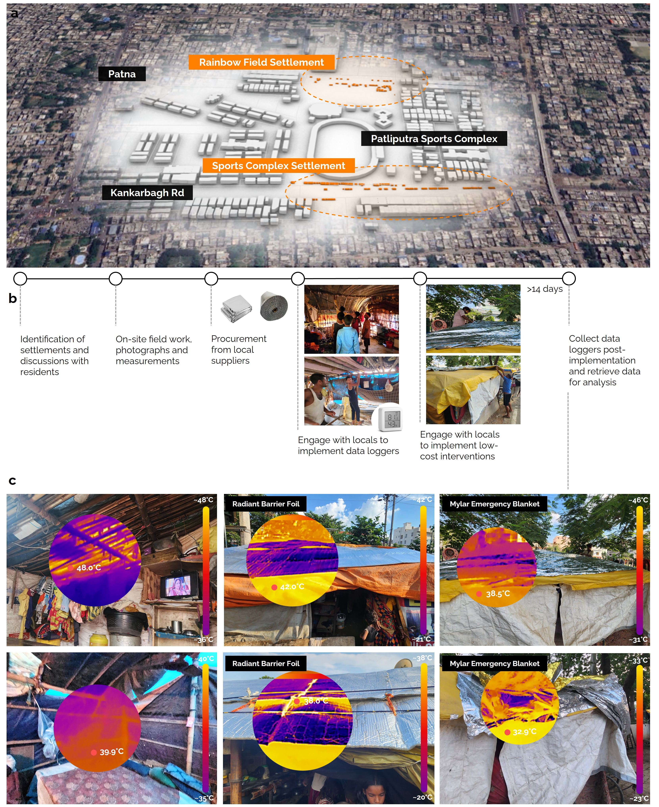

## Low-cost Cooling Interventions for Informal Settlements (Bihar, India)



### Overview
This repository contains data, analysis code, and figures for a study evaluating low-cost passive cooling interventions for informal housing in Bihar, India. We study Radiant Barrier Foils (RBF) and Mylar Emergency Blankets (MEB) against controls using minute-level indoor temperatures from 42 loggers across two settlements. Using a difference-in-differences design with over 2.28 million
temperature observations from 42 data loggers across two settlement locations,
we find that both interventions provide significant cooling effects, with a pooled intervention benefit of 1.12°C, RBF reducing indoor temperatures by 1.24°C, and MEB reducing indoor temperatures by 0.97°C relative to control structures.

### Quickstart
- Create and activate a virtual environment (Windows PowerShell):
  - `python -m venv .venv`
  - `.\.venv\Scripts\Activate.ps1`
- Install dependencies: `pip install -r requirements.txt`
- Open the notebooks in `Data Analysis/` to reproduce the analysis, or run the plotting scripts below to regenerate figures.
- Important: The plotting scripts expect the working directory to be `Data Analysis/`.

### Repository Structure (key items)
```
├── Data Analysis/
│   ├── data_analysis.ipynb                              # Primary data processing and descriptive analysis
│   ├── did_analysis (updated).ipynb                     # Difference-in-differences models (main results)
│   ├── did_analysis (old).ipynb                         # Archival DID analyses
│   ├── Compare_Graph_Preview.py                         # Average daily comparison plots
│   ├── Compare_Graph_Temperature.ipynb                  # Average daily comparison plots (Temperature)
│   ├── Compare_Graph_TemperatureDifference.ipynb        # Average daily comparison plots (Temperature)
│   ├── graph.py                                         # EDA: scatter/box plots, correlations, t-tests
│   ├── hexbin_plots.py                                  # Temperature–humidity hexbin plots with WBGT guides
│   ├── Cleaned Data/                                    # Processed logger files per device
│   └── Loggers Data/                                    # Raw logger exports
├── Environmental Data.csv                               # Hourly weather data (joined in analysis)
├── download_weather.py                                  # Weather.com scraper (optional; not required to reproduce)
└── requirements.txt                                     # Python dependencies
```

### Experimental Setting
- **Location**: Informal settlements in Bihar, India
- **Study Period**: June 4 - August 6, 2024
- **Sample**: 42 households across two settlement clusters
  - Rainbow Field Settlement: 17 structures
  - Sports Complex Settlement: 25 structures

### Interventions
1. **Radiant Barrier Foils (RBF)**: Reflective aluminum foil barriers installed on roof structures
2. **Mylar Emergency Blankets (MEB)**: Reflective emergency blankets applied to roofing materials  
3. **Control**: No intervention

### Data Overview
- Logger network: 42 indoor temperature/humidity devices across two settlements (Rainbow Field, Sports Complex); 1-minute sampling.
- Intervention periods per device are specified in `Data Analysis/logger_flags.csv`:
  - Columns include `Loggers`, `Settlement`, `Intervention` (`RBF`, `MEB`, `CONTROL`), `Shaded` (boolean), `Intervention_Start`, `Post_Intervention_End`.
- `Data Analysis/temperature_differences.csv`:
  - Wide format with `DateTime` and one column per logger of indoor–outdoor temperature differences (°C).
- `Environmental Data.csv`:
  - Hourly weather time series joined to logger data in notebooks/scripts.

### Key Findings (from DID models)
| Effect | Estimate (°C) | 95% CI | p-value |
|--------|----------------|--------|---------|
| Pooled intervention effect | -1.12 | [ -1.82, -0.42 ] | 0.002 |
| RBF effect | -1.24 | [ -1.98, -0.50 ] | 0.001 |
| MEB effect | -0.97 | [ -1.68, -0.27 ] | 0.007 |

Negative coefficients indicate cooling. Standard errors clustered at the logger level.

### Method Summary
We estimate difference-in-differences models comparing treated and control structures before and after intervention deployment, with settlement fixed effects, and time controls. Outcome is indoor–outdoor temperature (°C).

### Software Requirements
- Python 3.8+
- Dependencies in `requirements.txt` (includes `pandas`, `numpy`, `matplotlib`, `seaborn`, `scipy`, `statsmodels`, `scikit-learn`, `requests`, `beautifulsoup4`, `jupyter`).

### Weather Scraper (optional)
`download_weather.py` scrapes current conditions from Weather.com at fixed intervals and appends to monthly CSVs (`weather_data_YYYYMM.csv`). It is not required to reproduce the paper figures and may break if the site layout changes.
- Run: `python download_weather.py`
- Stop with Ctrl+C. Logs are written to `weather_scraper.log` with rotation.

### Ethical Considerations
- Community consent obtained; identifiers anonymized; materials left with participants.

### License
MIT License. See `LICENSE`.

### Effectiveness
- **Significant cooling benefits**: 0.97-1.24°C temperature reduction
- **Easy implementation**: Suitable for community-led deployment

Keywords: informal settlements, passive cooling, difference-in-differences, urban heat, Bihar, India

### Attribution / Citation / Paper
Ang YQ, Wang T, Sparsh, Chew LW (2026). Low-cost interventions for heat stress mitigation in urban informal settlements. *Nat Cities* (2026) https://doi.org/10.1038/s44284-025-00370-3

### BibTeX
```bibtex
@article{ang2026lowcost,
  title     = {Low-cost interventions for heat stress mitigation in urban informal settlements},
  author    = {Ang, Yu Qian and Wang, Tao and Sparsh and Chew, Lup Wai},
  journal   = {Nature Cities},
  year      = {2026},
  doi       = {10.1038/s44284-025-00370-3},
  url       = {https://www.nature.com/articles/s44284-025-00370-3}
}
```
